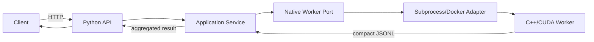

# MergenVision Phase 2

Offline video face analysis monorepo.

## Repository layout

```
MergenVisionPhase2/
├── backend/          # Python control plane + native GPU data plane
│   ├── app/          # FastAPI (future), domain, application services, ports, infra
│   ├── artifacts/    # Runtime models, engines, gallery, videos (not tracked)
│   ├── native/       # C++/CUDA GStreamer/DeepStream/TensoRT worker
│   ├── out          # Generated worker outputs under backend/out/ (not tracked)
│   ├── scripts/      # Production/job helper scripts
│   ├── tools/        # Developer/benchmark/visualisation tools
│   └── tests/        # Unit, integration and native parity tests
├── frontend/         # React + TypeScript UI (unchanged)
├── docs/             # Architecture, sprint plans and review packages
├── requirements/     # Requirements documents
├── docker/           # Docker support files
└── opensourcereferences/  # Upstream reference pointers
```

## Why `backend/native` is C++/CUDA

The production hot path must keep encoded video frames on the GPU from
bitstream to detection embedding:

```text
encoded bytes
  -> GStreamer demux/parser
  -> NVIDIA NVDEC
  -> NVMM GPU surface
  -> TensorRT face detector
  -> CUDA NMS / landmark decode
  -> compact metadata (bbox, landmarks, score)
  -> CPU boundary only for metadata
```

Python orchestrates the job, parses the compact metadata and performs final
aggregation; it never decodes or copies full frames.

## Developer quick start

Run the detector smoke test (requires Docker + NVIDIA GPU):

```bash
make backend-native-build
make backend-native-smoke
```

Run the backend CLI (from `backend/`):

```bash
cd backend
python -m app.cli detect \
  --video ../backend/artifacts/videos/friendsshort_50f.mp4 \
  --output ../backend/out/sprint-02-cli \
  --host-gpu 0
```

Run unit/layout tests:

```bash
make backend-unit
```

Run frontend tests:

```bash
make frontend-test
make frontend-build
```

## Future API call chain


